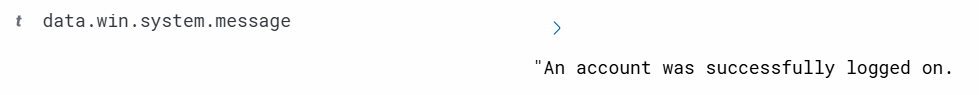

# Week 1 SOC Lab - Wazuh Authentication Monitor (Windows, Linux)

## Lab Environment
* Wazuh Server (Ubuntu server)
* Windows 11 agent
* Linux Ubuntu agent
* Analyst workstation

---

## Event Generation 

### Windows Test Event

* Successful logon - Event ID 4624.
* Trigger - Log out from Windows account and log back with normal user account.
* Search Queries: data.win.system.eventID:4624
* Wazuh queries screenshots:
  

Note: 
* Logon Type 2 is when user logs on workstation physically at the machine console entering their login credentials on Windows sign-in screen.
* Logon Type 5 used for services and server accounts. These are normal logon events when a user successfully logged in. Monitor unexpected accounts or unknown service installs.

---

* Failed logon - Event ID 4625
* Trigger - Lock or sign out from Windows account and enter incorrect password 3-5 times.
* Search Queries: data.win.system.eventID:4625
* Wazuh queries screenshots:

  

  
  
  

  

---

* Logoff - Event ID 4634
* Trigger - sign out from user account.
* Search Queries: data.win.system.eventID:4634
* Wazuh queries screenshots:

---

### Linux Test Event

* SSH authentication failed.
* Trigger - Putty into Ubuntu virtual machine and enter incorrect password few times.
* Search Queries: sshd* (sshd=secure shell daemon with wildcard).
* Wazuh queries screenshots:

---

* SSH successful login.
* Trigger - Putty into Ubuntu virtual machine and enter correct username and password.
* Search Queries: sshd* (sshd=secure shell daemon with wildcard).
* Wazuh queries screenshots:

---

Note:
* agent_ip - the ip address of the monitored agent.
* data.srcip - the source ip address of the event. The ip address of the system making an SSH login attempt.

---

Analysis & Takeaways
* Confirmed Windows 4624/4625/4634 events successful, failed, and logoff activity is being forward to Wazuh.
* Linux SSH events (failed/successful logins) confirm 'sshd' authentication logs are being forwarded to Wazuh.
* Repeated Event ID 4625 failed logon attempts = potential brute force attack.
* Unusual Event ID 4624 logons (odd logon type, service accounts).
* Linux repeated PAM authentication failures = possible password guessing attack.
  
